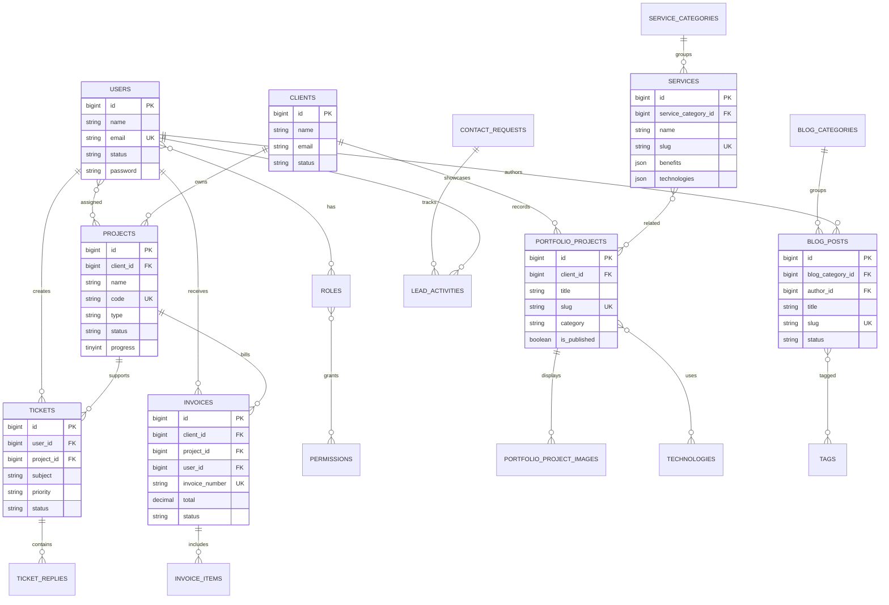

# ERD Diagram

```mermaid
erDiagram
    USERS ||--o{ TICKETS : creates
    USERS ||--o{ INVOICES : receives
    USERS }o--o{ PROJECTS : assigned
    USERS }o--o{ ROLES : has
    ROLES }o--o{ PERMISSIONS : grants

    CLIENTS ||--o{ PROJECTS : owns
    CLIENTS ||--o{ PORTFOLIO_PROJECTS : showcases
    PROJECTS ||--o{ TICKETS : supports
    PROJECTS ||--o{ INVOICES : bills
    TICKETS ||--o{ TICKET_REPLIES : contains
    INVOICES ||--o{ INVOICE_ITEMS : includes

    SERVICE_CATEGORIES ||--o{ SERVICES : groups
    SERVICES }o--o{ PORTFOLIO_PROJECTS : related
    PORTFOLIO_PROJECTS ||--o{ PORTFOLIO_PROJECT_IMAGES : displays
    PORTFOLIO_PROJECTS }o--o{ TECHNOLOGIES : uses

    BLOG_CATEGORIES ||--o{ BLOG_POSTS : groups
    BLOG_POSTS }o--o{ TAGS : tagged
    USERS ||--o{ BLOG_POSTS : authors

    CONTACT_REQUESTS ||--o{ LEAD_ACTIVITIES : tracks
    USERS ||--o{ LEAD_ACTIVITIES : records

    USERS {
        bigint id PK
        string name
        string email UK
        string status
        string password
    }

    CLIENTS {
        bigint id PK
        string name
        string email
        string status
    }

    PROJECTS {
        bigint id PK
        bigint client_id FK
        string name
        string code UK
        string type
        string status
        tinyint progress
    }

    SERVICES {
        bigint id PK
        bigint service_category_id FK
        string name
        string slug UK
        json benefits
        json technologies
    }

    PORTFOLIO_PROJECTS {
        bigint id PK
        bigint client_id FK
        string title
        string slug UK
        string category
        boolean is_published
    }

    BLOG_POSTS {
        bigint id PK
        bigint blog_category_id FK
        bigint author_id FK
        string title
        string slug UK
        string status
    }

    TICKETS {
        bigint id PK
        bigint user_id FK
        bigint project_id FK
        string subject
        string priority
        string status
    }

    INVOICES {
        bigint id PK
        bigint client_id FK
        bigint project_id FK
        bigint user_id FK
        string invoice_number UK
        decimal total
        string status
    }
```
